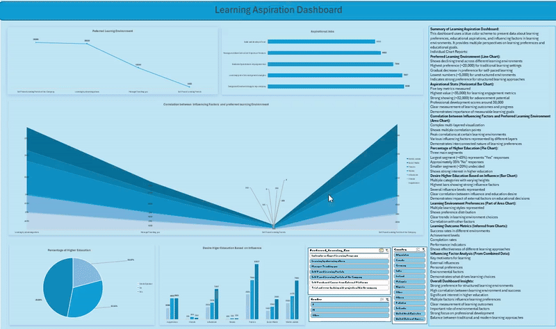
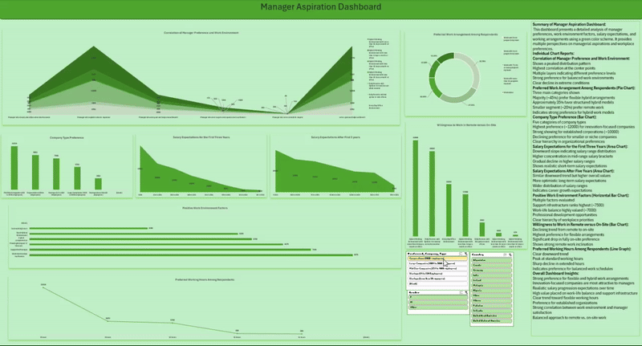
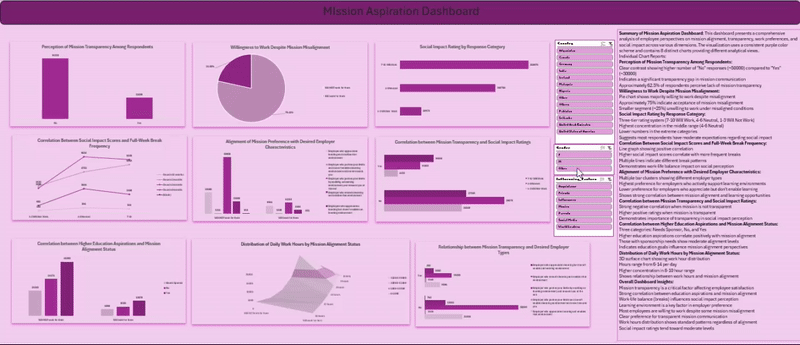

# Customized Excel Dashboards

This repository contains customized dashboards for learning aspirations, manager aspirations, and mission aspirations, using detailed visualizations and analytical insights.
## Preview of Dashboards

Below is a preview of how the dashboards function. Click the GIFs for an interactive view.

### Learning Aspirations Dashboard

## Introduction
The Learning Aspiration Dashboard is a comprehensive analytics tool designed to visualize and analyze learning preferences, educational aspirations, and influencing factors in learning environments. Using a professional blue color scheme, this dashboard provides multiple perspectives on how individuals engage with different learning environments and their educational goals.

## Dashboard File
- `Learning_Aspiration_Dashboard.xlsx` - Main dashboard file with all charts and analysis
- Source data is integrated within the workbook

## Excel Skills Used
- Advanced Chart Creation (Line, Bar, Area, Pie Charts)
- Data Validation
- Custom Formatting
- Formula Development
- Pivot Tables
- Dynamic Ranges
- Dashboard Layout Design
- Color Scheme Implementation

## Dashboard Components

### 📊 Charts and Visualizations

#### 📈 Preferred Learning Environment - Line Chart
- Tracks preferences across different learning environments
- Shows highest preference (~20,000) for traditional learning
- Demonstrates declining trend toward unstructured environments
- Helps identify optimal learning setting preferences

#### 📊 Aspirational Statistics - Horizontal Bar Chart
Key metrics measured:
- Learning Engagement (~35,000)
- Advancement Potential (~32,000)
- Professional Development (~30,000)
- Learning Outcomes
- Progress Tracking

#### 🌊 Correlation Analysis - Area Chart
- Multi-layered visualization showing relationships between:
  - Learning environment preferences
  - Influencing factors
  - Success rates
  - Environmental impacts

#### 🥧 Higher Education Distribution - Pie Chart
Distribution of higher education aspirations:
- Yes: ~45%
- No: ~35%
- Undecided: ~20%

#### 📊 Education Influence Factors - Bar Chart
- Analysis of factors influencing higher education decisions
- Multiple influence categories
- Clear correlation visualization
- Impact measurement of external factors

### 🧮 Key Metrics and Calculations

#### 📈 Learning Outcome Metrics
- Success rate calculations
- Achievement level measurements
- Completion rate tracking
- Performance indicators
- Trend analysis formulas

#### 📊 Influence Factor Analysis
Comprehensive analysis of:
- Key motivators for learning
- External influence factors
- Personal preference weights
- Environmental impact scores

### 🎯 Dashboard Implementation

The dashboard provides:
- Interactive filtering options
- Dynamic data updates
- Customizable views
- Real-time calculation updates
- Cross-chart filtering capabilities

### ❎ Data Validation
- Input validation rules
- Data range checks
- Category validation
- Consistency checks
- Error prevention measures

## Key Insights
1. Strong preference for structured learning environments
2. High correlation between environment and success rates
3. Significant interest (45%) in pursuing higher education
4. Multiple factors influence learning preferences
5. Clear focus on professional development
6. Measurable learning outcomes across different environments

## Conclusion
The Learning Aspiration Dashboard serves as a powerful tool for understanding educational preferences and aspirations. It effectively visualizes the complex relationships between learning environments, personal preferences, and success factors. The insights derived from this dashboard can be valuable for educational institutions, training programs, and professional development initiatives in optimizing their learning approaches.
### Manager Aspiration Dashboard

### Mission Aspiration Dashboard

## Dashboard Summaries

### 1. Learning Aspiration Dashboard (Blue Theme)

**Objective**: Analyze educational aspirations, preferred learning environments, and influencing factors.  
**Key Charts**:
- **Preferred Learning Environment (Line Chart)**: Displays a trend in preferred learning settings over time.
- **Aspirational Stats (Horizontal Bar Chart)**: Shows metrics like engagement and professional development.
- **Correlation between Influencing Factors and Preferred Environment (Area Chart)**: Multi-layered visualization.
- **Higher Education Percentage (Pie Chart)**: Highlights interest in higher education.
- **Desire for Higher Education (Bar Chart)**: Correlates influential factors with higher education aspirations.

**Excel Skills Used**:
- Charts and Graphs
- Data Validation
- Complex Formulas (e.g., `FILTER()`, `MEDIAN()`)

---

### 2. Manager Aspiration Dashboard (Green Theme)

**Objective**: Provide insights into manager work preferences, salary expectations, and work arrangements.  
**Key Charts**:
- **Manager Preference vs. Work Environment (Area Chart)**: Illustrates distribution of preferences.
- **Preferred Work Arrangement (Pie Chart)**: Shows hybrid, flexible, and on-site preferences.
- **Company Type Preference (Bar Chart)**: Visualizes types of companies preferred by managers.
- **Salary Expectations for 3 Years (Area Chart)**: Depicts salary distribution trends.
- **Work Environment Factors (Horizontal Bar Chart)**: Ranks factors like work-life balance.

**Excel Skills Used**:
- Charts and Graphs
- Complex Data Manipulation
- Data Validation

---

### 3. Mission Aspiration Dashboard (Purple Theme)

**Objective**: Analyze perspectives on mission transparency, work preferences, and social impact.  
**Key Charts**:
- **Mission Transparency Perception (Bar Chart)**: Shows "Yes" vs. "No" responses.
- **Willingness to Work despite Misalignment (Pie Chart)**: Displays proportions for willingness.
- **Social Impact Ratings (Bar Chart)**: Highlights rating distribution.
- **Correlation between Breaks and Social Impact (Line Chart)**: Shows relationships between factors.
- **Employer Characteristics and Mission Alignment (Bar Chart)**: Illustrates preferred employer types.

**Excel Skills Used**:
- Advanced Filtering Techniques
- Custom Formulas
- Interactive Data Validation

---

## File Information

- **Final Dashboard Files**:
  - `Learning_Aspiration_Dashboard.xlsx`
  - `Manager_Aspiration_Dashboard.xlsx`
  - `Mission_Aspiration_Dashboard.xlsx`
- **Dataset**: Real-world data for each dashboard scenario.

